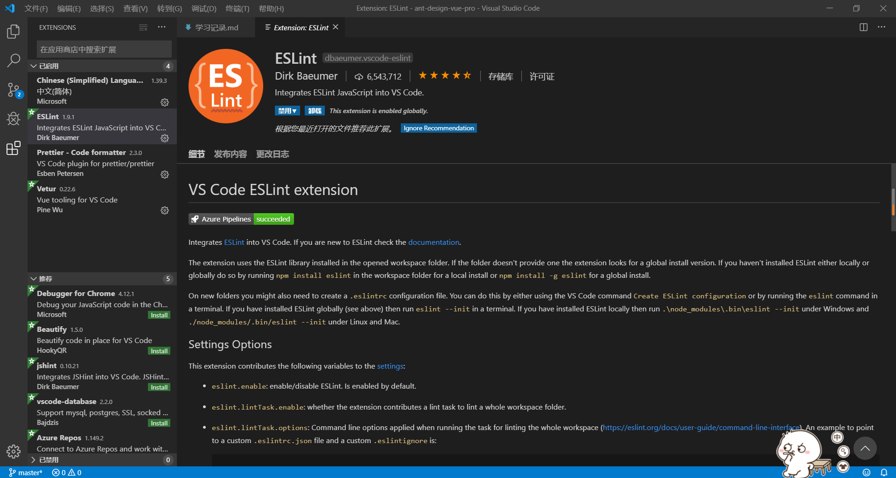

# 11.1    vue-cli3创建项目

## 第一步

**勾选**

Babel

Router

Vuex

css Pre-processor

Linter/Formater

## 第二步

选择history路由

## 第三步

选择less作为style预编译语言

## 第四步

linter和格式化选择

ESLint + Prettier

## 第五步

配置Lint

全选，

保存时Lint(**Lint on save**)

提交时Lint(**Lint and fix on commit**)

## 第六步

选择Jest作为单元测试工具

## 第七步

选择配置分散在各个文件中，而不是全放在package.json中

选择 In dedicated config files

## 第八步

 配置文件类型选择后，会提示你是否把这个保存为一个**预置**的项目，也就是之后通过脚手架来创建的模板。这里N是大写，即默认是不设置。所以我们输入y来确定这个选项。 

为模板起一个名字方便以后使用 ant-design-vue-pro-yyf

# 11.2配置eslint和prettier

## eslint

在vue项目创建的时候，选择了eslint，在vscode中还要安装eslint的插件



### 配置文件

```javascript
//.eslintrc.js
module.exports = {
  root: true,
  env: {
    node: true,
  },
  // extends: ["plugin:vue/essential", "@vue/prettier"],
  extends: ['plugin:vue/strongly-recommended', '@vue/prettier'],
  rules: {
    'no-console': process.env.NODE_ENV === 'production' ? 'error' : 'off',
    'no-debugger': process.env.NODE_ENV === 'production' ? 'error' : 'off',
  },
  parserOptions: {
    parser: 'babel-eslint',
  },
  overrides: [
    {
      files: ['**/__tests__/*.{j,t}s?(x)', '**/tests/unit/**/*.spec.{j,t}s?(x)'],
      env: {
        jest: true,
      },
    },
  ],
};

```

## prettier

同样，在vue项目创建的时候，选择了prettier，在vscode中还要安装prettier的插件


### 配置文件

```javascript
//.prettierrc.js
module.exports = {
  printWidth: 120, // 一行最大多少字符
  tabWidth: 2, // tab占用的字符数
  useTabs: false, // 是否使用tab代替空格
  semi: true, // 是否每句后都加分号
  singleQuote: true, // 是否使用单引号
  jsxSingleQuote: false, // jsx是否使用单引号
  trailingComma: 'all', // 数组尾逗号。
  bracketSpacing: false, // {foo: xx}还是{ foo: xx }
  jsxBracketSameLine: false, //看官网
  arrowParens: 'always', //剪头函数参数是否使用（）
};
```

# 11.3如何配置webpack和babel

less相关webpack配置

```javascript
module.exports = {
  css: {
    loaderOptions: {
      // 向 CSS 相关的 loader 传递选项
      less: {
        javascriptEnabled: true,
      },
    },
  },
};
```


